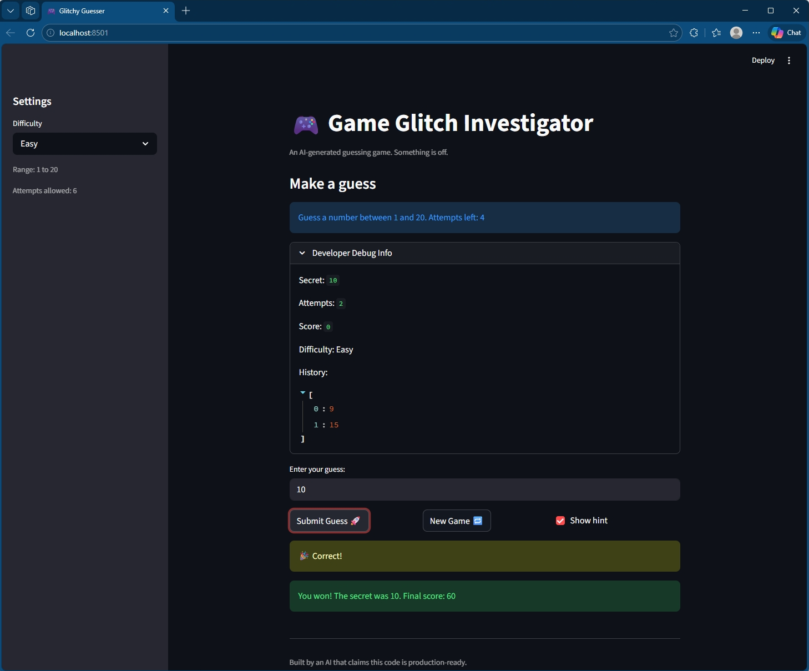
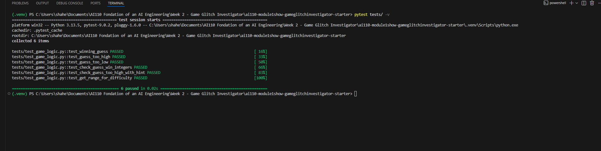
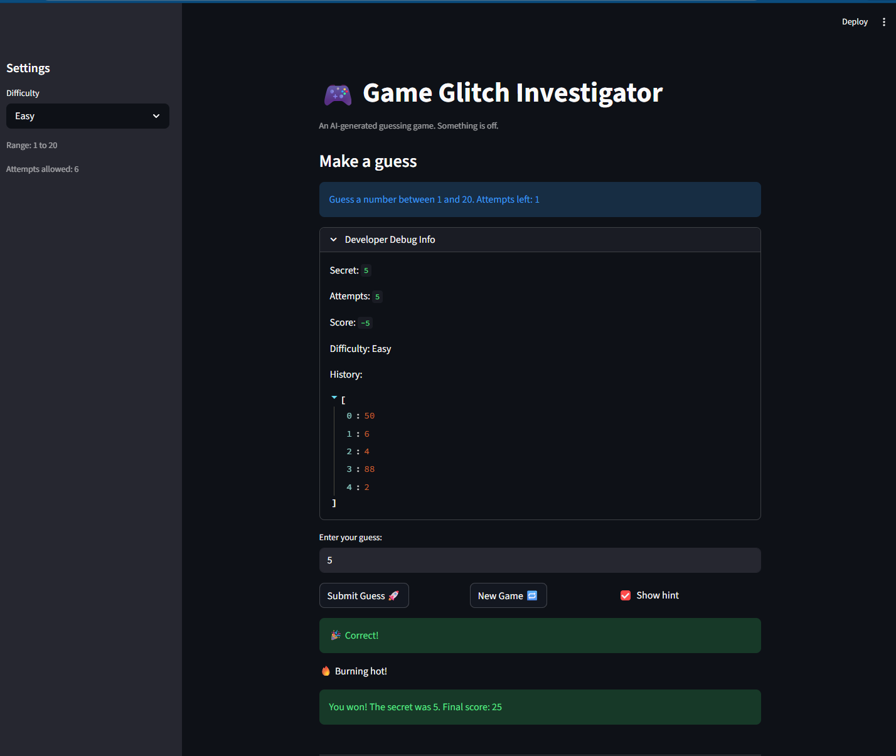

# 🎮 Game Glitch Investigator: The Impossible Guesser

## 🚨 The Situation

You asked an AI to build a simple "Number Guessing Game" using Streamlit.
It wrote the code, ran away, and now the game is unplayable. 

- You can't win.
- The hints lie to you.
- The secret number seems to have commitment issues.

## 🛠️ Setup

1. Install dependencies: `pip install -r requirements.txt`
2. Run the app: `python -m streamlit run app.py`

## 🕵️‍♂️ Your Mission

1. **Play the game.** Open the "Developer Debug Info" tab to see the secret number. Try to win.
2. **Find the State Bug.** Why does the secret number change every time you click "Submit"?
3. **Fix the Logic.** The hints ("Higher/Lower") are wrong. Fix them.
4. **Refactor & Test.** Move the logic into `logic_utils.py`, run `pytest`, keep fixing until all tests pass!

## 🐛 Bugs Found and Fixed

| Bug | Location | Fix Applied |
|---|---|---|
| Guess prompt showed wrong range (1-100 instead of difficulty range) | `app.py` | Replaced hardcoded values with `{low}` and `{high}` |
| Attempts counter started at 1 instead of 0 | `app.py` | Changed `attempts = 1` to `attempts = 0` |
| Secret cast to string on even attempts causing wrong hints | `app.py` / `logic_utils.py` | Removed type-mangling block, always pass secret as int |
| New Game button generated secret outside difficulty range | `app.py` | Changed `randint(1, 100)` to `randint(low, high)` and reset all session state |

## 📝 Document Your Experience

**Game Purpose:**
A number guessing game built with Streamlit where the player tries to guess 
a secret number within a set number of attempts. The difficulty level controls 
the range and number of attempts allowed.

**AI Tools Used:**
Claude in VS Code was used as the primary AI debugging partner throughout 
Phase 1 and Phase 2. It helped identify bugs, suggest fixes, generate pytest 
tests, and verify changes across multiple files.

**Key Learning:**
AI tools are powerful debugging partners but require human oversight. 
Claude caught most bugs correctly but missed resetting all session state 
in the New Game button fix — caught through live browser testing.

## 📸 Demo

## ✅ Pytest Results

## 🚀 Stretch Features

## 🚀 Stretch Features

### Challenge 4: Enhanced Game UI
Added color-coded hints, Hot/Cold emoji states, and win/loss summary.

